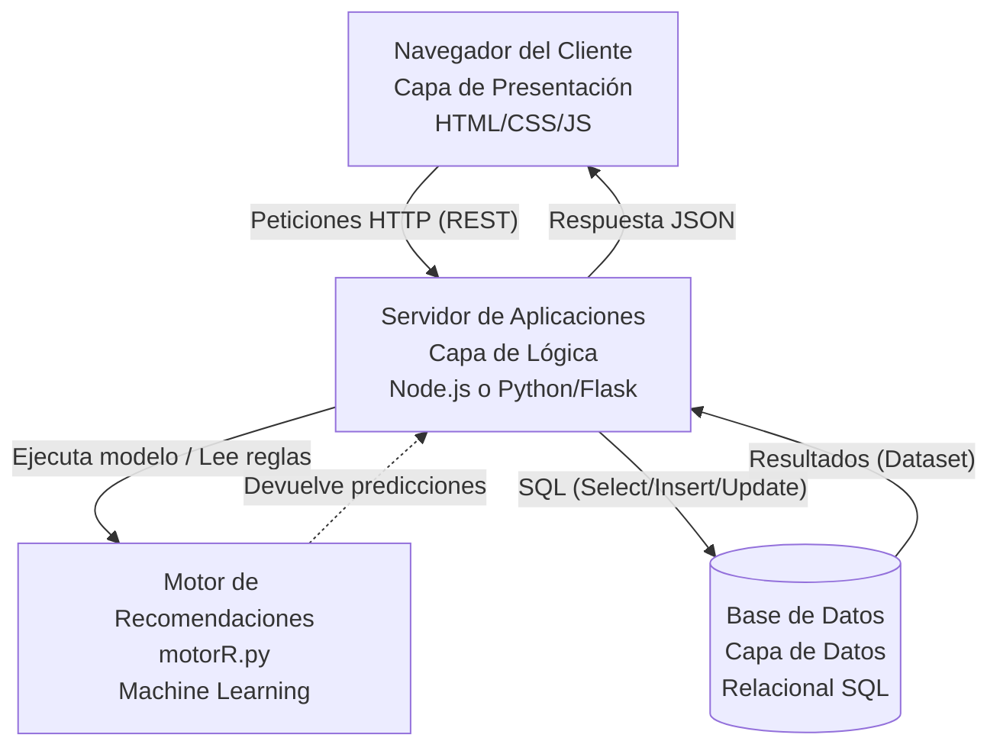
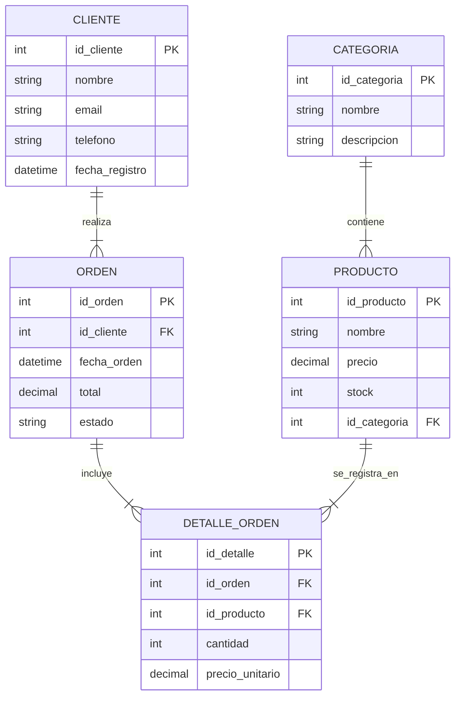

# Entregable: Análisis y Diseño del Sistema de Información

**Nombre del Proyecto:** Sistema de Comercio Electrónico con Recomendaciones de Usuario
**Curso:** Sistemas de Información

---

## Parte 1: Identificación del tipo de sistema

### Análisis y Clasificación
El sistema de carrito de compras y tienda online se clasifica de forma híbrida e integra dos tipos fundamentales de Sistemas de Información:

1. **Sistema de Procesamiento de Transacciones (TPS - Transaction Processing System):** 
   El núcleo principal de la aplicación es procesar las transacciones cotidianas de negocio del comercio electrónico (ej. añadir productos al carrito, registrar pedidos, procesar el pago y actualizar el inventario de la base de datos).
2. **Sistema de Soporte a Decisiones (DSS - Decision Support System):** 
   Gracias a la integración del script de recomendaciones (`motorR.py`), el servidor es capaz de usar datos previos (Machine Learning - Reglas de Asociación Apriori) para predecir qué producto le interesará más al consumidor, dándole un apoyo automatizado para su decisión de compra.

### Justificación
- **Funcionalidad:** Actúa capturando datos operativos (clientes, órdenes, detalles del pedido) de primera línea (TPS) y al mismo tiempo provee salidas analíticas con las sugerencias personalizadas extraídas de los comportamientos (DSS).
- **Usuarios:** Utilizado por los clientes/consumidores (quienes interactúan con la interfaz para comprar) y por los administradores (que revisan métricas o el estado de la base de datos).
- **Tipo de información que maneja:** Datos altamente estructurados para las compras (entidades relacionales como Clientes, Productos, Ordenes) y de comportamiento para el algoritmo de predicción (reglas de asociación estáticas json).

---

## Parte 2: Diseño de la arquitectura del sistema

### Definición de la Arquitectura
El sistema adopta una **Arquitectura Cliente-Servidor de Tres Capas (Three-Tier Architecture)** en una instancia logicamente **Centralizada** (aunque adaptable en la nube):

1. **Capa de Presentación (Frontend):** Responsable de la interfaz web (UI), las vistas del catálogo y el estado reactivo del carrito de compras virtual. Se comunica de forma asíncrona (AJAX/Fetch) mediante protocolo HTTP.
2. **Capa de Lógica de Negocio (Backend):** Recibe las solicitudes, genera sesiones de compra, consulta la base de reglas del motor de recomendaciones y estructura los datos.
3. **Capa de Datos (Base de Datos):** Gestiona permanentemente la persistencia de usuarios, transacciones comerciales y disponibilidad de inventario utilizando el gestor de bases de datos relacional.

### Diagrama de Arquitectura


### Explicación de los componentes
- **Interfaces (usuario):** El cliente se conecta usando un navegador. Visualiza una sola vista dinámica (SPA/Aplicación tradicional). No necesita procesar la información, simplemente demanda vistas e interactúa al seleccionar productos.
- **Procesamiento lógico (Servidor):** El backend se encarga de interceptar y validar las compras, sumar totales y despachar de forma pasiva las operaciones a la DB. Interactúa con el motor de IA conectándose mediante ejecución de sub-procesos o lectura de archivos JSON generados por Python.
- **Base de Datos:** Almacena todos los atributos en un entorno fuertemente tipado. Actúa sólo cuando el servidor Lógico se lo requiere.
- **Flujo de Información:** Cliente hace clic -> Servidor HTTP procesa -> Interroga DB (si necesita stock) y Motor de IA (si necesita recomendar) -> Retorna JSON agrupado -> Cliente Visualiza.

---

## Parte 3: Diseño de la base de datos

### Entidades Principales y Atributos

1. **Categoria:** `id_categoria` (PK), `nombre`, `descripcion`.
2. **Producto:** `id_producto` (PK), `nombre`, `precio`, `stock`, `id_categoria` (FK).
3. **Cliente:** `id_cliente` (PK), `nombre`, `email`, `telefono`, `fecha_registro`.
4. **Orden:** `id_orden` (PK), `id_cliente` (FK), `fecha_orden`, `total`, `estado`.
5. **Detalle_Orden:** `id_detalle` (PK), `id_orden` (FK), `id_producto` (FK), `cantidad`, `precio_unitario`.

### Relaciones
- **Uno a Muchos (1:N):** 
  - Una *Categoría* tiene múltiples *Productos* (1:N). Un Producto pertenece a una sola Categoría.
  - Un *Cliente* puede realizar varias *Órdenes* (1:N). Una Orden pertenece solo a un Cliente.
  - Una *Orden* puede tener varios *Detalles_Orden* (1:N).
- **Muchos a Muchos (N:M):**
  - Indirectamente, una Orden incluye muchos Productos y un Producto puede estar en muchas Órdenes; esta relación de muchos a muchos está rota correctamente gracias a la tabla pivote **Detalle_Orden**.

### Diagrama Entidad-Relación (ER) y Modelo Relacional


---

## Parte 4: Implementación de la base de datos

*(El script SQL físico, con 5 tablas y 10 registros en cada una, se ha adjuntado en el archivo independiente y generado las evidencias presentadas a continuación).*

### Evidencias de Ejecución
Ejemplo de ejecución real desde nuestra consola usando SQLite y los sentencias del archivo:
```text
sqlite> .read sistema_ecommerce.sql

--- Total de clientes registrados ---
total_clientes
--------------
10            
--- Productos con sus categorías ---
Producto              precio  Categoria          
--------------------  ------  -------------------
Ficus Lyrata          45.5    Plantas de Interior
Limonero 1m           60      Árboles Frutales   
Aloe Vera             15      Suculentas y Cactus
Tierra Preparada 5kg  8       Macetas y Sustratos
Abono Orgánico        12      Fertilizantes      
--- Ordenes y sus montos por cliente ---
id_orden  Cliente       total  estado    
--------  ------------  -----  ----------
1         Juan Perez    106.5  Completada
4         Ana Martinez  55     Completada
8         Elena Torres  15     Completada
--- Detalle de la Orden 1 ---
id_orden  Producto              cantidad  precio_unitario  subtotal
--------  --------------------  --------  ---------------  --------
1         Ficus Lyrata          1         45.5             45.5    
1         Tierra Preparada 5kg  1         8                8       
```
*(Para el script SQL ver el documento anexo `sistema_ecommerce.sql`)*

---

## Parte 5: Integración al sistema

### Cómo se conecta la BD con el sistema
El sistema actual hace uso de un intermediario (ORM o Driver como `sqlite3` o `pg`) dentro de la capa de Lógica. El servidor backend expone *EndPoints* (rutas REST) que abren la conexión, emiten consultas SQL procesadas y envían la respuesta en JSON hacia la vista (Frontend).

### Flujo de datos general (Ejemplo de Carrito a BD)
1. El usuario presiona el botón "Comprar" en el Frontend (UI).
2. JS agrupa un objeto JSON: `{"cliente": 1, "productos": [{"id": 1, "cant": 1}]}`.
3. Se realiza una solicitud POST a `/api/checkout`.
4. El servidor Backend procesa la solicitud, y si los productos tienen `stock` en la DB, crea un registro usando la sentencia de inserción `INSERT INTO ordenes...`.
5. Por cada producto de esa compra, itera: `INSERT INTO detalles_orden...`.
6. Al finalizar exitosamente la transacción atómica SQL, el backend devuelve el HTTP Status Code 200 (OK).

### Ejemplo de consulta real (Dentro del código del servidor)
Cuando el usuario desea visualizar el historial de sus compras al entrar a su perfil, el sistema Backend efectúa automáticamente una consulta parametrizada de este estilo para obtener los datos de la BD:

```sql
SELECT O.fecha_orden, O.total, O.estado, D.cantidad, P.nombre, P.precio
FROM ordenes O
JOIN detalles_orden D ON O.id_orden = D.id_orden
JOIN productos P ON D.id_producto = P.id_producto
WHERE O.id_cliente = ?; 
-- El "?" es reemplazado de manera segura bajo el capo por el id_cliente logeado.
```
