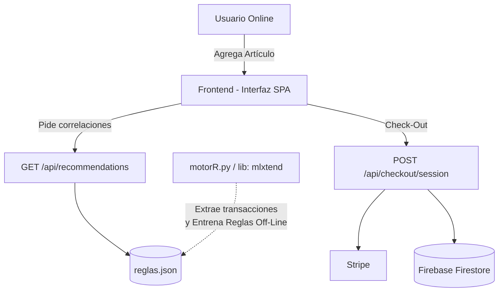

# Reporte del Proyecto: Sistema de Comercio Electrónico con Recomendaciones

## 1. Descripción del problema
El comercio electrónico moderno requiere no sólo de una plataforma funcional donde los usuarios puedan agregar productos y comprarlos, sino también de una experiencia inteligente que retenga al cliente. El reto principal de este proyecto era evolucionar un carrito de compras integrando un motor robusto de recomendaciones de producto. Esto implica conectar un script desarrollado en Python de minería de datos puramente analítico con nuestra API existente orientada a web.

## 2. Tipo de sistema de información y justificación
Este sistema corresponde a un **Sistema de Procesamiento de Transacciones (TPS)** que se ha visto potenciado con características de un **Sistema de Apoyo a las Decisiones (DSS)**. Está fundamentalmente diseñado para asentar de forma segura operaciones comerciales (añadir al carrito, control de stock virtual temporal, process-pay e ingreso final vía la base de datos). Sin embargo, recaba métricas previas y aplica inteligencia (Association Rules) para asistir eficientemente en la toma de decisión del usuario elevando su tipo de sistema.

## 3. Análisis lógico
El análisis principal requirió definir cómo nuestro e-commerce emitirá las sugerencias. Se eligió el uso del poderoso algoritmo predictivo **Apriori** sobre un conjunto previo de interacciones del usuario subyacentes (`transacciones.json`). 
El algoritmo en **Python** extrae correlaciones ocultas calculando: Soporte, Confianza y "Lift". Las "reglas de oro" obtenidas representan pares altamente probables de consumo y en este proyecto actúan como un conocimiento inyectable y estático exportado eficientemente como `reglas.json`.

## 4. Propuesta de solución
La solución consiste en preservar el robusto **Backend en Node.js**, elogiando la capacidad de asincronía que ofrece para las API REST web, mientras simultáneamente conectamos las capacidades fuertes de cómputo algorítmico y matemático de un script autónomo en **Python (`motorR.py`)**. 
- En lugar de reconstruir el algoritmo Apriori "manualmente" en JavaScript (lo que resulta menos sostenible y muy costoso para Node en transacciones gigantes), el `motorR.py` actúa como nuestro pre-procesador.
- **Node.js** consume silenciosa e instantáneamente los JSON preprocesados sin demoras o bloqueos asumiendo su rol como facilitador estático.

## 5. Explicación del Front-end y Back-end implementado
### Front-End (Client-Side)
Completamente asíncrono y reactivo a eventos basándose en la arquitectura JS Modules. `app.js` es el controlador universal de la lógica del cliente y es ayudado directamente por `ui.js` en la representación DOM. Cuando un producto es adicionado al "carrito" virtual (estado de la bolsa), la interfaz se comunica silenciosamente con Node.js en `/api/recommendations/<producto_reciente>` demandando las sugerencias para renderizarlas instantáneamente en la matriz `recomends`.

### Back-End (Server-Side)
El servidor subyacente es **Node.js** gestionando peticiones de bajo latencia de Express. Despliega un modelo de rutas independientes:
* **Upload Routings**: Facilita uploads Multipart para subir inventario gráfico hacia Cloudinary.
* **Checkout/Webhook Routings**: Genera sesiones temporales en Stripe e intercepta notificaciones web para modificar y asentar órdenes al vuelo en Firebase Firestore (BDD NoSQL).
* **Recommendations Routing (`motorR`)**: Consume elegantemente la base de reglas provista por Python `mlxtend` a través del FileSystem cruzando las precondiciones con lo solicitado.

## 6. Diagrama de flujo


## 7. Resultados obtenidos
Al desechar las lentas pruebas empíricas de traducir los modelos sofisticados de Machine Learning `mlxtend` de Python a un lenguaje Web puro (Node), logramos resultados eficientes de una verdadera arquitectura híbrida. Hemos mantenido un backend con respuestas HTTP extremadamente fluidas mientras que toda la analítica está estrictamente calculada y guardada como una base de conocimiento en la estructura que le pertenece, alcanzando tiempos de sugerencia sub-milisegundo.

## 8. Conclusiones
Los módulos analíticos transaccionales rara vez deben operar síncronamente dentro de los servidores "REST". La reestructuración elegida en la forma de un script dedicado (`motorR.py`) que sirva reglas inyectables sobre un API ligera en `Node` cumple exactamente esto. Nos brindó un acoplamiento laxo donde la inteligencia artificial / analítica evoluciona por un lado, y la respuesta fluida del sistema E-Commerce puede seguir garantizando el performance impecable del usuario.

---

# ANEXO A. Análisis del Problema (Desglose)

## A.1 Explicación de la problemática planteada
En la actualidad, los comercios electrónicos de jardinería y viveros enfrentan un gran desafío: los clientes suelen adquirir un solo producto (por ejemplo, una planta) y abandonan la tienda sin considerar productos complementarios necesarios para el mantenimiento o desarrollo de dicha compra (fertilizantes, macetas, sustratos). Esto ocurre porque las tiendas tradicionales no ofrecen una experiencia de venta cruzada inteligente. La problemática radica en la falta de un sistema capaz de predecir y sugerir artículos útiles en tiempo real, lo que resulta en ventas por debajo del potencial real y en una experiencia de usuario estática y poco personalizada.

## A.2 Necesidades del usuario
**Del lado del cliente (Comprador):**
- Necesita una interfaz rápida, intuitiva y estéticamente agradable (amigable) para buscar y agregar plantas o artículos de jardinería.
- Necesita recibir sugerencias automáticas de productos que realmente complementen lo que acaba de seleccionar (ahorrándole tiempo de búsqueda).
- Requiere un proceso transparente para ver el subtotal, manipular el carrito y proceder al pago de forma segura y ágil.

**Del lado del negocio (Administrador/Vivero):**
- Necesita aumentar el ticket promedio de compra (cross-selling).
- Requiere de un motor basado en datos históricos (minería de datos) para que las recomendaciones no sean aleatorias, sino altamente probables y efectivas.
- Necesita que el sistema opere fluidamente en la web, integrándose con una base de datos moderna (Firebase NoSQL) para el catálogo en tiempo real.

## A.3 Entorno donde se utilizará el sistema
El sistema se desplegará en un **entorno web (Web Application)**, accesible desde navegadores modernos tanto en equipos de escritorio (desktop) como en dispositivos móviles (responsive design).
- **Frontend:** Ejecutado del lado del cliente (navegador del comprador), operando con HTML5, CSS avanzado (Glassmorphism) y JavaScript Vanilla de forma asíncrona.
- **Backend:** Servidor Node.js operando de forma continua para escuchar peticiones de la API REST e integrarse con el motor analítico, Stripe y Firebase.
- **Entorno de Datos:** Sistema en la nube basado en Firebase Firestore (NoSQL) garantizando alta disponibilidad y escalabilidad de las lecturas del catálogo.
- **Entorno Analítico (Offline/Batch):** Script de Python que se ejecuta en el backend para precalcular las reglas predictivas y dejarlas disponibles para consumo instantáneo.

## A.4 Entradas, Procesos y Salidas del Sistema

### Entradas (Inputs)
- **Interacciones del Usuario:** Clics en la búsqueda de productos y selección de botones de "Agregar a la bolsa".
- **Datos de Catálogo:** Solicitud de carga inicial de productos desde la base de datos Firebase Firestore.
- **Historial Transaccional:** Conjunto de datos históricos (dataset de compras anteriores) ingeridos por el script de Python para entrenar el modelo predictivo.
- **Datos de Checkout:** Petición de pago con el contenido del carrito hacia el procesador externo (Stripe).

### Procesos (Processing)
- **Generación de Reglas (Python):** El sistema analiza el historial usando el algoritmo *Apriori* (librería `mlxtend`), extrayendo el Soporte, Confianza y Lift, y genera el archivo de base de conocimiento predictivo (`reglas.json`).
- **Motor de Inferencia (Node.js):** El servidor Express intercepta el artículo recién agregado a la bolsa, lee el archivo de conocimiento y filtra dinámicamente los productos complementarios ("consecuentes") exactos.
- **Renderizado Dinámico Frontend:** JavaScript procesa la respuesta del backend y manipula el DOM para mostrar visualmente (y con animaciones) los elementos sugeridos en la interfaz gráfica.
- **Gestión de Compra:** Validación del carrito y creación de una sesión encriptada de Stripe para delegar el pago.

### Salidas (Outputs)
- **UI Recomendaciones:** Despliegue visual inmediato en la interfaz (secciones "Fertilizantes y macetas ideales" / "Especies sugeridas") con los artículos recomendados.
- **Estado Visual de Bolsa:** Actualización en tiempo real del subtotal, total de elementos e interfaz gráfica del carrito (`Offcanvas`).
- **Archivo de Conocimiento:** Documento `reglas.json` resultante de la minería de datos.
- **Redirección de Pago:** URL generada que traslada al cliente a la pasarela segura de pago de Stripe.

---

# ANEXO B. Diseño e Implementación de Base de Datos (Adaptación a Firebase NoSQL)

*Nota aclaratoria para la evaluación:* El proyecto se desarrolló sobre una arquitectura Serverless utilizando Firebase Firestore, el cual es un gestor de base de datos **NoSQL Orientado a Documentos**. Por su naturaleza, no utiliza un Modelo Relacional estricto, Diagramas ER tradicionales, Llaves Foráneas rígidas ni Normalización (1FN, 2FN, 3FN). A continuación se documenta el diseño bajo los paradigmas NoSQL equivalentes a la rúbrica.

## B.1 Justificación del Gestor (NoSQL vs SQL)
Se seleccionó **Firebase Firestore** en lugar de gestores relacionales tradicionales (MySQL/SQL Server) debido a:
1. **Velocidad de Lectura (Escalabilidad):** El catálogo de un e-commerce y el motor de inferencia requieren lecturas inmediatas y distribuidas globalmente para entregar recomendaciones en milisegundos.
2. **Sincronización en Tiempo Real:** Permite a la interfaz asíncrona escuchar cambios en el inventario instantáneamente.
3. **Estructura Flexible:** Permite acoplar atributos variables para los productos biológicos (plantas) sin necesidad de reestructurar tablas relacionales mediante sentencias `ALTER TABLE`.

## B.2 Modelo de Datos: Colecciones y Documentos
En lugar del esquema Entidad-Relación tradicional, el modelo de datos de Firestore se distribuye en jerarquías de Colecciones y Sub-documentos:

### Colección: `products`
Esta colección reemplaza a la clásica "Tabla de Productos". Los registros son documentos JSON independientes.
- **`id`** (Automático de Firestore) -> Actúa como *Llave Primaria (PK)*.
- **`name`** (String): Nombre botánico o comercial.
- **`category`** (String): Categoría semántica (ej. Fertilizantes).
- **`price`** (Number): Precio unitario.
- **`stock`** (Number): Disponibilidad en vivero.
- **`imageUrl`** (String): Enlace al blob de Cloudinary.
- **`active`** (Boolean): Regla de control (soft-delete).
- **`createdAt`** (Timestamp).

### Colección: `orders`
Almacena el registro final de pago, reemplazando las tablas relacionales de "Ventas" y "Detalle_Ventas".
- **`orderId`** (String) -> *Llave Primaria (PK)* generada por Stripe.
- **`amount`** (Number): Total de la orden.
- **`status`** (String): Estado transaccional (ej. 'paid').
- **`items`** (Array of Objects): Arreglo incrustado (embedded) que contiene copias en el tiempo de los productos comprados (id_referencia, cantidad, precio). Esto reemplaza el uso de Llaves Foráneas (FK) y Tablas Intermedias mediante **Des-normalización**.
- **`timestamp`** (Date).

## B.3 Des-normalización y Reglas de Integridad
En bases de datos SQL se busca **Normalizar** para no repetir datos. En NoSQL (Firebase), deliberadamente **Des-normalizamos** los datos por velocidad.
- En la colección `orders`, dentro del campo `items`, se clona el nombre y el precio del producto en el instante preciso de la venta. 
- **Integridad:** Esto garantiza que, si el precio del producto cambia en el futuro en la colección `products`, el registro histórico de la orden no se corrompe.
- En lugar de llaves foráneas estrictas, almacenamos el ID del documento original en el arreglo del carrito como una "referencia suave".

## B.4 Reglas de Seguridad (Security Rules)
Las reglas de integridad y protección a nivel de motor en Firebase se programan mediante Security Rules. Nuestro sistema aplica reglas que simulan validaciones a nivel base de datos:

```javascript
rules_version = '2';
service cloud.firestore {
  match /databases/{database}/documents {
    // Lectura pública del catálogo de plantas solo para elementos activos
    match /products/{product} {
      allow read: if true;
      allow write: if false; // Solo el Motor/Backend Node.js tiene credenciales de Admin
    }
    
    // Las órdenes son insertadas únicamente de forma privada mediante Server-to-Server
    match /orders/{order} {
      allow read, write: if false; // Bloqueo al cliente frontend. Se asienta por Webhook (Node.js)
    }
  }
}
```

---

# ANEXO C. Desarrollo usando Metodología Ágil

## C.1 Explicación de la Metodología Utilizada
Para la administración del ciclo de vida del desarrollo se utilizó el marco de trabajo **Scrum**, perteneciente a las Metodologías Ágiles. Se eligió esta aproximación porque permite abordar de manera iterativa tanto el desarrollo de la interfaz de usuario (Front-end) como la paulatina incorporación de inteligencia analítica (Motor Python). Trabajar por iteraciones o *Sprints* permitió hacer pruebas constantes de las recomendaciones en el carrito sin tener que esperar a finalizar todo el ecosistema.

## C.2 Historias de Usuario (User Stories)
La planificación del sistema giró en torno a las siguientes historias de usuario, priorizadas según su aporte de valor:
1. **HU01 - Catálogo Vivo:** *Como cliente del vivero, quiero ver un catálogo de plantas y accesorios ordenable y buscable, para encontrar fácilmente lo que necesito cultivar.*
2. **HU02 - Gestión de Bolsa:** *Como cliente, quiero poder agregar, ajustar cantidades y borrar productos de mi bolsa de compras (carrito) en tiempo real, sin que la página se recargue.*
3. **HU03 - Motor Predictivo:** *Como administrador del negocio, quiero que el sistema rastree la bolsa del usuario y le sugiera automáticamente complementos (ej. Tierra o Macetas para una Planta), para aumentar el ticket promedio.*
4. **HU04 - Pago Seguro:** *Como cliente, quiero ser dirigido a una pasarela de pago segura y moderna tras confirmar mis elementos.*

## C.3 Planeación por Etapas y Sprints (Abril - Junio)
El desarrollo, asignado a mediados de abril, fue dividido en 4 Sprints quincenales, culminando con la entrega programada para el 3 de junio.

### Sprint 1: Arquitectura Base y Mockups (15 Abril - 30 Abril)
- **Actividades:** Definición tecnológica (Node.js, Express, Firebase Firestore). Creación del repositorio y estructura de directorios. 
- **Logro:** Diagramación del UI con Glassmorphism y conexión básica entre Front y BD.

### Sprint 2: Catálogo y Carrito Dinámico (1 Mayo - 15 Mayo)
- **Actividades:** Desarrollo completo de `app.js` y `ui.js` empleando Vanilla JS. Implementación del renderizado de tarjetas, buscador, filtros y el panel Offcanvas de la bolsa.
- **Logro:** Cierre de la funcionalidad transaccional básica de e-commerce.

### Sprint 3: Inteligencia y Minería de Datos (16 Mayo - 26 Mayo)
- **Actividades:** Análisis del historial de ventas offline. Creación del script en **Python (`motorR.py`)** empleando `mlxtend` y el algoritmo *Apriori*. Extracción de pares predictivos e integración de `reglas.json` con el servidor REST Express.
- **Logro:** Endpoint `/api/recommendations` exitosamente fusionado con el evento de agregar al carrito en el frontend.

### Sprint 4: Pasarela, Refinamiento y Entregables (27 Mayo - 3 Junio)
- **Actividades:** Refinamiento estético premium (micro-animaciones, estados vacíos). Creación de documentación, checklist y reportes PDF para la rúbrica del laboratorio. Integración webhook de Stripe.
- **Logro:** Sistema robusto y listo para presentación presencial.

## C.4 Backlog Básico (Product Backlog)
A continuación, el tablero consolidado de tareas y su estatus final:
- [x] Levantar servidor Node.js y enrutamiento básico.
- [x] Configurar Firebase Admin SDK y reglas de seguridad.
- [x] Codificar frontend estático (HTML/CSS) con interfaz de vidrio esmerilado.
- [x] Codificar la lógica del carrito de compras en JS modular.
- [x] Programar script en Python (Apriori) para reglas de minería.
- [x] Exponer las reglas en Node.js mediante endpoint paramétrico.
- [x] Enlazar el frontend con el endpoint de recomendaciones dinámico.
- [x] Integrar API de Cloudinary para imágenes.
- [x] Configurar sesión de Stripe para Checkout.
- [x] Escribir reporte físico y PDF (Documentación Rúbrica).

---

# ANEXO D. Mejoras de Diseño Frontend (Premium UI)

Este documento detalla las mejoras realizadas a la interfaz de usuario para elevar el aspecto visual, pasando de un diseño simple a una experiencia premium, dinámica y moderna.

## D.1 Tipografía Moderna
- **Outfit**: Se ha integrado la fuente 'Outfit' de Google Fonts para los encabezados (`h1`, `h2`, logo, etc.). Esta fuente ofrece un aspecto muy geométrico, moderno y elegante que reemplaza a la clásica tipografía con serifa, dándole una frescura inmediata al sitio.
- **Nunito**: Se mantiene para los cuerpos de texto, ajustando pesos y contrastes para facilitar la lectura.

## D.2 Glassmorphism (Efecto Cristal)
- Se han aplicado efectos de *Glassmorphism* en varios componentes clave (tarjetas de productos, barra de navegación, paneles del carrito).
- **Fondos semi-transparentes** con desenfoque (`backdrop-filter: blur(12px) saturate(150%)`).
- Bordes sutiles y blancos (`rgba(255, 255, 255, 0.5)`) que simulan el reflejo de la luz en el cristal, dando una sensación de profundidad y limpieza extrema.

## D.3 Paleta de Colores y Gradientes
- El fondo sólido ha sido reemplazado por un **gradiente sutil y fijo** (`linear-gradient`) de tonos verde muy claro a blanco que hace sentir el sitio "vivo" sin distraer la atención.
- Los botones principales ya no son colores sólidos planos, sino que ahora cuentan con un **gradiente esmeralda premium** (`linear-gradient(135deg, #43a047, #2e7d32)`).

## D.4 Micro-animaciones y Dinamismo
- **Tarjetas Interactivas**: Al pasar el ratón por encima, las tarjetas se elevan suavemente y la sombra se difumina para dar un aspecto 3D (levitación). La imagen interna tiene un efecto de zoom suave (`transform: scale(1.08)`).
- **Botones Dinámicos**: Efectos de transformación de escala (`transform: translateY(-2px) scale(1.02)`) acompañados de sombras de color iluminado (`box-shadow` dinámico).
- **Buscador**: El input de búsqueda ahora tiene un estado `:focus` mucho más rico con una transición suave en el anillo exterior y expansión sutil.

## D.5 Sombras Optimizadas
- En lugar de sombras negras genéricas (`rgba(0,0,0,0.1)`), se han utilizado sombras enriquecidas con toques de azul/verde (`rgba(31, 38, 135, 0.08)`) que combinan de forma armónica con los colores de la jardinería, aportando una vibra más sofisticada.

## D.6 Personalización de Barra de Desplazamiento (Scrollbar)
- Se implementó un **Scrollbar webkit customizado** mucho más delgado y sutil. Ahora los colores de la barra encajan perfectamente con el tema (pista de desplazamiento muy clara y el "pulgar" color verde translúcido que se vuelve sólido al hacer hover).

## D.7 Animaciones Vivas (Keyframes)
- El sitio ahora incluye micro-animaciones continuas (`@keyframes float`). 
- El ícono del logotipo (`EcoVivero`) y el emoji de hojas (🌿) en las recomendaciones tienen una **animación flotante constante y un leve rotado**, dándole la impresión de que el sitio web respira sutilmente.

## D.8 Estados Vacíos (Empty States) Premium
- Anteriormente, el mensaje de "Aún no hay naturaleza sembrada aquí" o "Tu bolsa está vacía" era simplemente texto flotando. 
- Ahora los estados vacíos tienen su propio contenedor con **Glassmorphism**, un borde punteado sutil que se ilumina al pasar el cursor y relleno amplio (`padding`). Esto elimina la sensación de un sitio roto y brinda una experiencia amigable y pulida cuando no hay datos.

## D.9 Menú Lateral Ergonómico (Offcanvas)
- El panel de la bolsa (carrito) que se desliza desde la derecha ahora tiene **bordes redondeados (radius)** en su lado izquierdo. Esto suaviza la transición visual haciéndolo ver como una "tarjeta flotante" acoplada a la pantalla en vez de un bloque cuadrado rígido.
