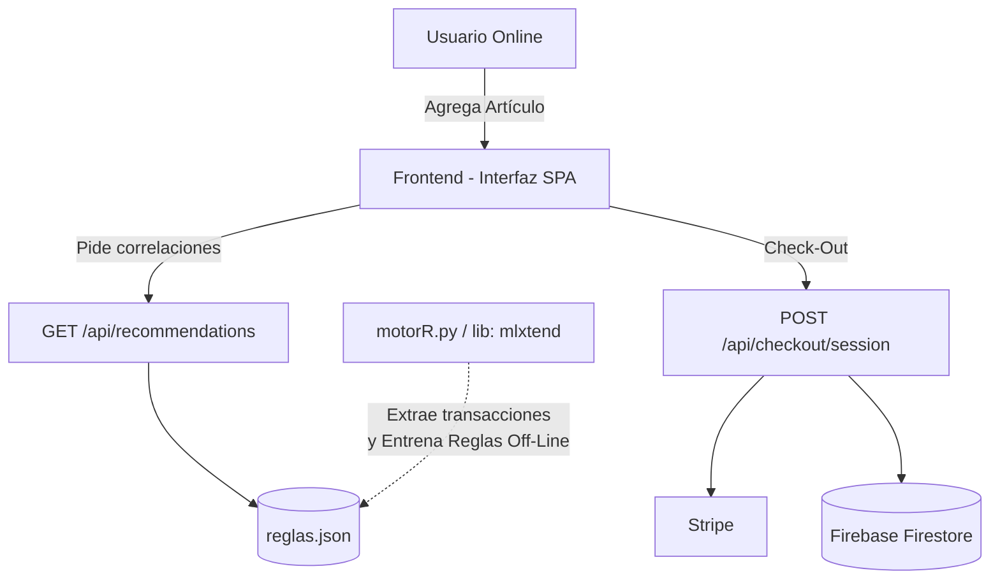

# Reporte del Proyecto: Sistema de Comercio Electrónico con Recomendaciones

## 1. Descripción del problema
El comercio electrónico moderno requiere no sólo de una plataforma funcional donde los usuarios puedan agregar productos y comprarlos, sino también de una experiencia inteligente que retenga al cliente. El reto principal de este proyecto era evolucionar un carrito de compras integrando un motor robusto de recomendaciones de producto. Esto implica conectar un script desarrollado en Python de minería de datos puramente analítico con nuestra API existente orientada a web.

## 2. Tipo de sistema de información y justificación
Este sistema corresponde a un **Sistema de Procesamiento de Transacciones (TPS)** que se ha visto potenciado con características de un **Sistema de Apoyo a las Decisiones (DSS)**. Está fundamentalmente diseñado para asentar de forma segura operaciones comerciales (añadir al carrito, control de stock virtual temporal, process-pay e ingreso final vía la base de datos). Sin embargo, recaba métricas previas y aplica inteligencia (Association Rules) para asistir eficientemente en la toma de decisión del usuario elevando su tipo de sistema.

## 3. Análisis lógico
El análisis principal requirió definir cómo nuestro e-commerce emitirá las sugerencias. Se eligió el uso del poderoso algoritmo predictivo **Apriori** sobre un conjunto previo de interacciones del usuario subyacentes (`transacciones.json`). 
El algoritmo en **Python** extrae correlaciones ocultas calculando: Soporte, Confianza y "Lift". Las "reglas de oro" obtenidas representan pares altamente probables de consumo y en este proyecto actúan como un conocimiento inyectable y estático exportado eficientemente como `reglas.json`.

## 4. Propuesta de solución
La solución consiste en preservar el robusto **Backend en Node.js**, elogiando la capacidad de asincronía que ofrece para las API REST web, mientras simultáneamente conectamos las capacidades fuertes de cómputo algorítmico y matemático de un script autónomo en **Python (`motorR.py`)**. 
- En lugar de reconstruir el algoritmo Apriori "manualmente" en JavaScript (lo que resulta menos sostenible y muy costoso para Node en transacciones gigantes), el `motorR.py` actúa como nuestro pre-procesador.
- **Node.js** consume silenciosa e instantáneamente los JSON preprocesados sin demoras o bloqueos asumiendo su rol como facilitador estático.

## 5. Explicación del Front-end y Back-end implementado
### Front-End (Client-Side)
Completamente asíncrono y reactivo a eventos basándose en la arquitectura JS Modules. `app.js` es el controlador universal de la lógica del cliente y es ayudado directamente por `ui.js` en la representación DOM. Cuando un producto es adicionado al "carrito" virtual (estado de la bolsa), la interfaz se comunica silenciosamente con Node.js en `/api/recommendations/<producto_reciente>` demandando las sugerencias para renderizarlas instantáneamente en la matriz `recomends`.

### Back-End (Server-Side)
El servidor subyacente es **Node.js** gestionando peticiones de bajo latencia de Express. Despliega un modelo de rutas independientes:
* **Upload Routings**: Facilita uploads Multipart para subir inventario gráfico hacia Cloudinary.
* **Checkout/Webhook Routings**: Genera sesiones temporales en Stripe e intercepta notificaciones web para modificar y asentar órdenes al vuelo en Firebase Firestore (BDD NoSQL).
* **Recommendations Routing (`motorR`)**: Consume elegantemente la base de reglas provista por Python `mlxtend` a través del FileSystem cruzando las precondiciones con lo solicitado.

## 6. Diagrama de flujo

## 7. Resultados obtenidos
Al desechar las lentas pruebas empíricas de traducir los modelos sofisticados de Machine Learning `mlxtend` de Python a un lenguaje Web puro (Node), logramos resultados eficientes de una verdadera arquitectura híbrida. Hemos mantenido un backend con respuestas HTTP extremadamente fluidas mientras que toda la analítica está estrictamente calculada y guardada como una base de conocimiento en la estructura que le pertenece, alcanzando tiempos de sugerencia sub-milisegundo.

## 8. Conclusiones
Los módulos analíticos transaccionales rara vez deben operar síncronamente dentro de los servidores "REST". La reestructuración elegida en la forma de un script dedicado (`motorR.py`) que sirva reglas inyectables sobre un API ligera en `Node` cumple exactamente esto. Nos brindó un acoplamiento laxo donde la inteligencia artificial / analítica evoluciona por un lado, y la respuesta fluida del sistema E-Commerce puede seguir garantizando el performance impecable del usuario.
